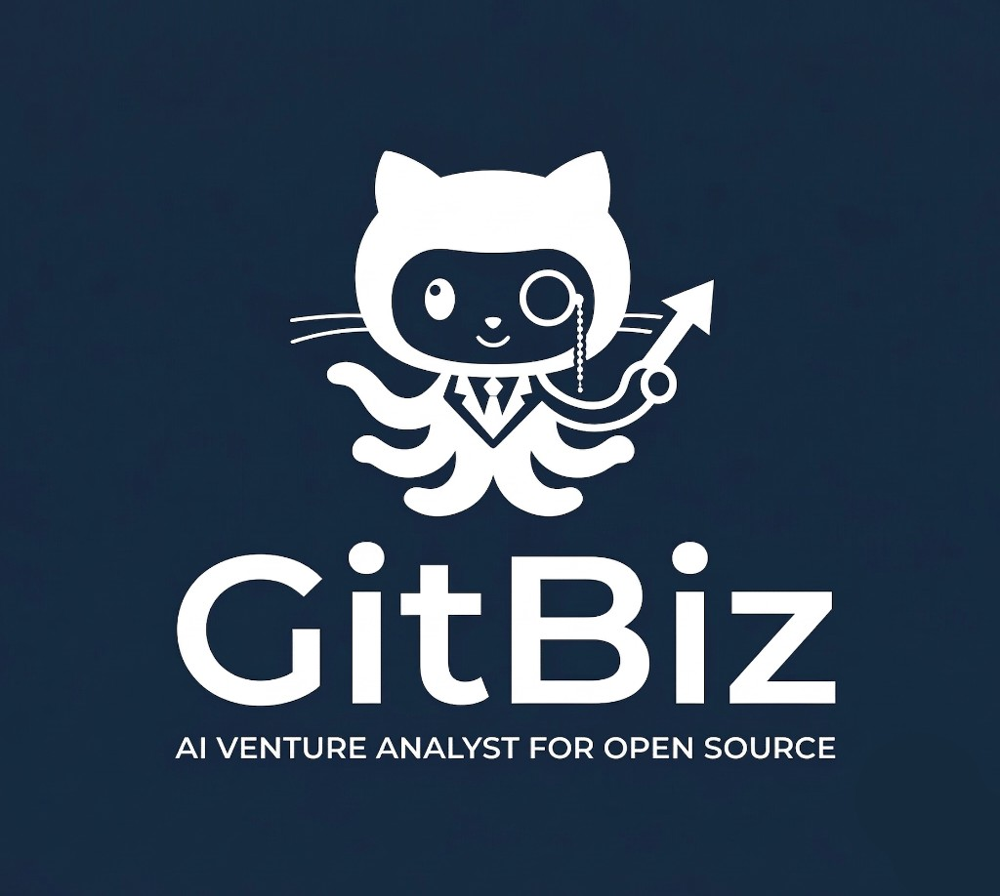

<p align="center">
  
</p>

# GitBiz — GitHub Opportunity Discovery Bot

A Discord bot that discovers open-source GitHub repositories, evaluates them for latent business and product potential using an LLM venture analyst, and streams approved findings directly to your Discord channel.

## Architecture

```
06:00 UTC ──► Daily keyword scan (run)
               ├─ 10 keywords from deterministic weekly cycle
               ├─ Per keyword: fetch top repos, take first 3 passing pre-filter
               ├─ is_seen(url) check — skip if already in DB
               ├─ LLM venture-analyst eval (README + structured prompt)
               ├─ KEEP + score ≥ 7.5 → upsert to DB + post to Discord
               └─ Posts up to 3 KEEPs, ~30 LLM calls max

10:00 UTC ──► Trending scan (run_quick, mode=trending)
               ├─ GitHub: stars≥10 created in last 7 days (2 queries)
               ├─ Evaluate one by one until 2 KEEPs posted
               └─ Max 20 LLM evals (quick_max_eval cap)

14:00 UTC ──► Popular scan (run_quick, mode=popular)
               ├─ GitHub: stars≥100 pushed in last 3 days
               ├─ Evaluate one by one until 2 KEEPs posted
               └─ Max 20 LLM evals (quick_max_eval cap)

/scan [keyword] ──► Quick scan (run_quick, mode=keyword)
               ├─ Keyword or 3 random from config
               └─ Stop on first KEEP ≥ 7.5, max 1 post

/trending, /popular ──► Same as cron runs, triggered on demand
```

**DB model:** only KEEPs are stored. REJECTs are never written. `is_seen(url)` prevents re-evaluating any repo already in DB.

## Setup

### 1. Prerequisites

- Python 3.12+
- A [Supabase](https://supabase.com) project
- A Discord bot application ([create one here](https://discord.com/developers/applications))
- A GitHub personal access token
- A [Google AI Studio](https://aistudio.google.com) API key (Gemini)

### 2. Create Discord Bot

1. Go to [Discord Developer Portal](https://discord.com/developers/applications)
2. Click **New Application**, give it a name
3. Go to **Bot** tab → click **Reset Token** → copy the token
4. You do **not** need **Message Content Intent** (slash commands only)
5. Go to **OAuth2 → URL Generator**:
   - Scopes: `bot`, `applications.commands`
   - Bot Permissions: `Send Messages`, `Embed Links`, `Read Message History`
6. Copy the generated URL and open it to invite the bot to your server
7. Right-click the target channel → **Copy Channel ID** (enable Developer Mode in Discord settings if needed)

### 3. Set Up Supabase

Run the SQL in `supabase/schemas/repos.sql` against your Supabase project (via the SQL Editor in the dashboard).

To clear the database for a fresh start:
```sql
truncate table public.repos restart identity;
```

### 4. Configure Environment

```bash
cp .env.example .env
```

| Variable | Required | Description |
|----------|----------|-------------|
| `DISCORD_TOKEN` | ✓ | Your Discord bot token |
| `DISCORD_CHANNEL_ID` | ✓ | Channel ID where the bot posts |
| `GITHUB_TOKEN` | ✓ | GitHub personal access token |
| `SUPABASE_URL` | ✓ | Your Supabase project URL |
| `SUPABASE_KEY` | ✓ | Supabase **service role** key (not anon) |
| `GEMINI_API_KEY` | ✓ | Google AI Studio API key |
| `LLM` | ✓ | Model name (e.g. `gemini-2.5-flash`) |

All other settings have defaults in `bot/config.py`:

| Setting | Default | Description |
|---------|---------|-------------|
| `REPOS_PER_KEYWORD` | `3` | Repos evaluated per keyword in daily scan |
| `MAX_POST_PER_RUN` | `3` | Max KEEPs posted per daily keyword scan |
| `QUICK_MAX_EVAL` | `20` | Max LLM evals per trending/popular run |
| `MIN_SCORE_TO_POST` | `7.5` | Minimum score to post to Discord |

### 5. Install & Run

```bash
python -m venv .venv
source .venv/bin/activate
pip install -r requirements.txt
python -m bot.main
```

## Slash Commands

| Command | Cooldown | Description |
|---------|----------|-------------|
| `/scan [keyword]` | 30s | Quick scan — evaluates one by one, posts first KEEP ≥ 7.5 |
| `/trending` | 60s | Scan recently created repos with fast star growth (last 7 days), up to 2 posts |
| `/popular` | 60s | Scan established repos (≥100 stars) with active recent pushes, up to 2 posts |
| `/crontest` | 600s | Manually trigger today's 10-keyword daily cycle |
| `/keywords` | — | List all 70 configured keywords and the daily cycle logic |
| `/top [count]` | — | Show the top N highest-scoring repos from the database |
| `/repo <url>` | 30s | Analyze a specific GitHub repo on demand |

## How It Works

### Daily keyword scan (06:00 UTC)

Uses a deterministic weekly cycle over 70 keywords:
- Keywords are shuffled once per week (seeded by ISO week number)
- Today's weekday selects a slice of 10 from that shuffled list
- Full coverage across all 70 keywords over 7 days, no repetition within a week

Per keyword: one GitHub API call for repos created in the last 14 days with ≥5 stars, sorted by stars. Takes the first **3 repos that pass the pre-filter**, evaluates each. Only KEEPs scoring ≥ 7.5 are stored and posted, up to 3 per run (~30 LLM calls max).

### Trending + Popular scans (10:00 + 14:00 UTC)

Broad signal scans not tied to keywords:
- **Trending**: repos created in the last 7 days with ≥10 stars (two threshold queries)
- **Popular**: repos with ≥100 stars pushed in the last 3 days

Both evaluate candidates one by one until 2 KEEPs are posted or the 20-eval cap is hit.

### LLM evaluation

The venture analyst prompt has five steps: understand → filter → identify latent opportunity → productize → score.

Rejects on any single disqualifier: purely academic, dataset/weights only, no identifiable paying user, personal/homework project, or abandoned. A repo must have a credible — not just conceivable — path to revenue.

Scores are weighted: `(0.5 × business_potential) + (0.3 × novelty) + (0.2 × ease_of_mvp)`. Only repos scoring ≥ 7.5 are posted to Discord.

### Dedup

Only KEEPs are written to the DB. `is_seen(url)` does a single DB read before any LLM call — if the URL exists, the repo is skipped immediately at zero cost. REJECTs are never stored, so the DB stays small and meaningful.

## Cost Estimate

Using `gemini-2.5-flash` with billing enabled:

| Run | Max evals/day | Est. cost/day |
|-----|--------------|---------------|
| Keyword scan (06:00) | 30 | ~$0.01 |
| Trending (10:00) | 20 | ~$0.007 |
| Popular (14:00) | 20 | ~$0.007 |
| **Total** | **70** | **~$0.025/day (~$0.75/month)** |

## Project Structure

```
bot/
├── main.py               # Entry point: Discord bot + APScheduler (3 cron jobs)
├── config.py             # Settings (env vars + defaults)
├── cogs/
│   └── commands.py       # /scan, /trending, /popular, /crontest, /keywords, /top, /repo
├── modules/
│   ├── ingestion.py      # GitHub API: keyword search, trending, popular strategies
│   ├── prefilter.py      # Deterministic filter (stars, fork, description, age, size)
│   ├── dedup.py          # is_seen(), upsert_keep(), mark_posted(), get_top_repos()
│   ├── evaluator.py      # LLM venture analyst prompt + JSON parsing + retry logic
│   ├── ranker.py         # Weighted score computation
│   ├── discord_poster.py # Discord embed builder
│   └── pipeline.py       # run() daily scan, run_quick() triggered scans, evaluate_single()
└── db/
    └── client.py         # Supabase singleton client
```
